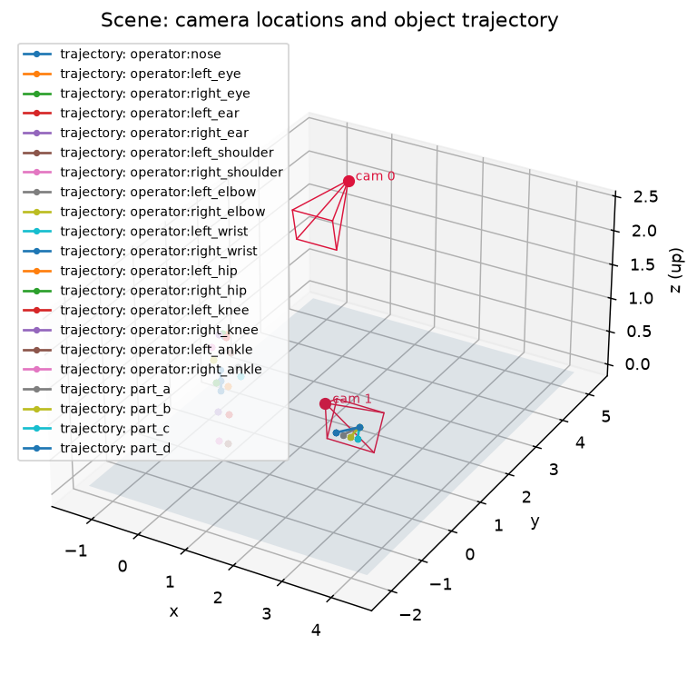

# Assembly-line walkthrough

A domain-neutral, multi-station work-order scenario: an operator assembles an
order at a station while cameras aimed at *different regions* of the space each
see a different part of the job. This walkthrough covers the scene, the
work-order ground truth, and how to run and inspect it.

> **Status.** What ships today is the **single-station** scene
> (`examples/assembly_station.py`): one operator, one worktop, two cameras, and
> full work-order ground truth. The multi-station *line* topology — several
> workstations with an operator routed between them, and station-completion
> mapped to work-order line-items — is tracked in #84 / #85 and is not
> implemented yet. This page documents what exists and will grow with it.

Everything here is deterministic, CPU-only, and needs no GL or renderer.

## The scene

`examples/assembly_station.py` builds one station:

| Entity | What it is | Where |
|---|---|---|
| `operator` | a COCO-17 skeleton | standing near the origin |
| `part_a`, `part_b`, `part_c` | abstract items | staged, then moved into the container |
| container | the target the items land in | `(2.9, 0.0, 0.92)`, east of the operator |

and two cameras, built through `CameraRig.stations(...)` with a `StationView`
each:

| Camera | Role | Position | Looks at | FOV |
|---|---|---|---|---|
| `0` overview | frames the **operator** | `(0.0, 4.2, 2.4)` | `(0.0, 0.0, 1.2)` | 40° |
| `1` worktop | frames the **items** | `(2.9, -1.1, 1.7)` | `(2.9, 0.0, 0.9)` | 44° |

World up is `+z` and the ground plane is `z = 0`, matching the rest of the sim
(see [DESIGN.md](../DESIGN.md)).

### Why two cameras aimed apart

This is the scene's reason for existing. The cameras cover **spatially separated
regions**, so their per-entity `in_view` flags are *complementary* — the operator
is visible to the overview camera and never to the worktop camera, and the items
are the exact opposite:

```
operator   overview in_view 11/11   worktop in_view  0/11
part_a     overview in_view  0/11   worktop in_view 11/11
part_b     overview in_view  0/11   worktop in_view 11/11
part_c     overview in_view  0/11   worktop in_view 11/11
```

That is the fusion story stated in ground truth: **different entities land in
different cameras' `in_view` with no schema change.** A consumer that wants both
"what is the person doing" and "which parts moved" has to fuse across cameras —
neither view alone carries the whole job.

Note this is *not* an occlusion story. There are no occluders here; the split
comes purely from where the cameras are aimed.

## Work-order ground truth (`order.json`)

Alongside the manifest, the example writes a verified order result:

```json
{
  "status": "fulfilled",
  "expected": {"part_a": 1, "part_b": 1, "part_c": 1},
  "placed":   {"part_a": 1, "part_b": 1, "part_c": 1},
  "missing": {}, "extra": {}, "wrong": {},
  "order_id": "ORD-1",
  "actions": [
    {"frame": 2, "action": "place", "item_id": "part_a",
     "entity_id": "operator", "hand_joint": "right_wrist",
     "hand_position": [-0.22, 0.337, 1.0]}
  ]
}
```

- `status` is the verdict; `expected` / `placed` are counts per item, and
  `missing` / `extra` / `wrong` are the three ways an order can fail. All four
  are present even when empty, so a consumer never has to guess a key.
- `actions` records **which joint** did each placement and **when**, so a
  downstream model's claim ("the operator placed `part_b` at frame 5") can be
  scored against truth rather than eyeballed.

Items move discretely: each sits at its staging spot until its `placed_at` frame,
then is at the container and stays. Placements land at frames **2, 5, 8**.

## The placement-synced preset (`--placement-synced`)

Off by default — without the flag the scene and every emitted file are
byte-identical to before. With it, the operator's continuous wrist reach is
replaced by discrete **hand dips** synced to the placements, and two deliberate
negatives are added to falsify naive temporal association:

- a **distractor dip** that places nothing, and
- a **distractor item** (`part_d`) whose *uncaused* move follows that dip inside
  the causal lag window.

A naive "the dip just before a move caused it" associator pairs those two. The
ground truth says otherwise — `interactions.json` carries only the **three** true
pairs, even though **four** items get placed:

```json
{
  "timing": {"action_lag": 1, "lag_window": 2},
  "actor_id": "operator", "tracked_joint": "right_wrist",
  "pairs": [
    {"actor_id": "operator", "item_id": "part_a", "action_frame": 1, "change_frame": 2},
    {"actor_id": "operator", "item_id": "part_b", "action_frame": 4, "change_frame": 5},
    {"actor_id": "operator", "item_id": "part_c", "action_frame": 7, "change_frame": 8}
  ]
}
```

`part_d` is placed at frame 11 and appears in no pair. That asymmetry is the
label a causal-fusion consumer scores precision/recall against.

## Running it

From the repo root:

```bash
# scene manifest + order.json (add --out DIR to write elsewhere)
python examples/assembly_station.py

# with the placement-synced preset: also writes interactions.json + pick_list.json
python examples/assembly_station.py --placement-synced
```

The default run prints its own summary and writes `manifest.json` and
`order.json` into `examples/out/` (which is gitignored):

```
[assembly_station] wrote manifest.json + order.json to .../examples/out
  camera 0 = overview (operator) | camera 1 = worktop (items)
  operator   overview in_view 11/11   worktop in_view  0/11
  ...
  order fulfilled
  action place part_a @frame 2 hand(right_wrist)=(-0.22,0.34,1.00)
  action place part_b @frame 5 hand(right_wrist)=(-0.22,0.28,1.00)
  action place part_c @frame 8 hand(right_wrist)=(-0.22,0.22,1.00)
```

### Coverage report

Any saved manifest reduces to per-camera coverage as JSON:

```bash
python scripts/coverage_metrics.py examples/out/manifest.json
```

For this scene that gives camera `0` a coverage fraction of **0.25** (11 of 44
entity-frames) and camera `1` **0.75** (33 of 44) — the 1-operator/3-item split,
straight out of the geometry. There are **no** overlap frames, **no** blind gaps
and **no** handoffs, which is the point: the two views partition the work rather
than sharing it.

Add `--panel` for the headless PNG version:

```bash
python scripts/coverage_metrics.py examples/out/manifest.json \
  --panel docs/assets/assembly_station_coverage_metrics.png
```


### Seeing the space in 3D

The 3D scene view draws both cameras' frustums, the ground plane, and every
entity's ground-truth trajectory in one figure — which makes the
"aimed at different regions" claim visible rather than asserted:

```bash
python scripts/view_scene_3d.py --manifest examples/out/manifest.json \
  --out docs/assets/assembly_station_scene_3d.png
```



The two frustums point at clearly separate volumes; the item trajectories all
terminate inside the worktop camera's cone, and the operator's joints sit inside
the overview camera's.

## Notes

- `matplotlib` is only needed for the `--panel` and 3D-view commands, and is
  imported lazily inside those scripts — the JSON paths stay dependency-free.
- Every command above is also available as `uv run python ...` per the
  [Quickstart](../README.md#quickstart).
